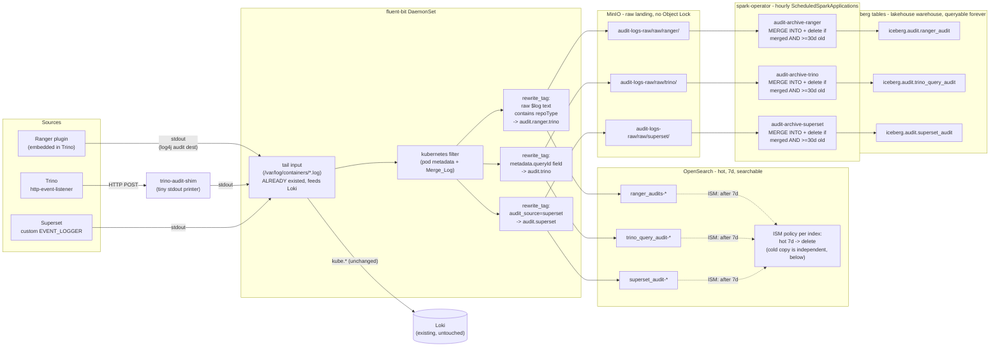

# Architecture

## Goal

Audit access-control decisions (Ranger), query execution (Trino), and user
actions (Superset) into:
- a **hot, searchable** store for day-to-day investigation, and
- a **cold, S3-compatible, immutable** archive for long-term compliance
  retention,

on a single-node k8s cluster that already runs Trino, Superset, Iceberg/
Nessie, MinIO, and Ranger.

## Why these choices

**Hot = OpenSearch, not the existing Loki.** Loki (already deployed for
generic container-log tailing) is line-oriented and label-indexed; it's
good at "show me logs from pod X" and bad at "show me every access denied
for user alice on table Y in the last 90 days, grouped by resource."
Ranger's own audit framework, and the audit ecosystem generally, is built
around Elasticsearch-shaped structured search. OpenSearch (Apache-licensed
successor to Elasticsearch, API-compatible) gives that: per-field
filtering, aggregations, and a Dashboards UI, at the cost of running an
extra stateful service.

**Cold = real Iceberg tables in the existing `lakehouse` warehouse**, not an
OpenSearch snapshot. An OpenSearch snapshot is only restorable to another
OpenSearch cluster — it isn't SQL-queryable on its own. The requirement
here is that the cold copy stay queryable indefinitely, so it's written as
actual Iceberg tables (Parquet data + Iceberg metadata) under the same
Nessie catalog / `lakehouse` warehouse Trino's `iceberg` catalog already
points at. Once loaded, it's just `SELECT * FROM iceberg.audit.ranger_audit`
— no restore step, no separate system to stand up to read it back.

**Loading via a periodic Spark job (the existing spark-operator)**, not a
hand-rolled Python/pyiceberg script. This cluster already runs
spark-operator and Spark is the standard tool for exactly this
raw-files-to-Iceberg batch pattern; reusing it means no new runtime to
introduce, and `ScheduledSparkApplication` gives cron scheduling, retries,
and run history for free. The raw JSON Fluent Bit lands in MinIO is the
handoff point between the two systems (see below for why fluent-bit can't
write Iceberg directly).

## Data flow

### Why the shim, and why nothing POSTs to fluent-bit directly

The obvious design is Trino and Superset POSTing JSON straight to a
fluent-bit `http` input, which forwards to OpenSearch. **This does not work
on this cluster's fluent-bit build** (`cr.fluentbit.io/fluent/fluent-bit:
5.0.9`, confirmed also broken on `3.1.9`): the `http` input never
successfully routes a record to any network-based output (`opensearch`,
`es`, even `loki`) — the input accepts the request (200/201, its own record
counter increments) but the engine logs `task ... without routes,
dropping` and the record is gone, with zero errors surfaced anywhere. This
was root-caused via isolated minimal repros outside the production
config — it reproduces with the simplest possible setup (one `http` input,
one `opensearch` output, no filters at all) and is unrelated to TLS, auth,
worker-thread settings, or which specific network output type is used.
Local outputs (`stdout`, `null`) are unaffected.

Given that, every source instead lands on some pod's **stdout**, which
fluent-bit's existing `tail` input already reads successfully (proven: it's
been shipping every pod's logs to Loki this whole time). That's why:
- **Superset** doesn't POST anywhere — its custom `EVENT_LOGGER` just
  `print()`s a JSON line, landing directly in its own container's stdout.
- **Trino** can't do that (`http-event-listener` only knows how to POST),
  so it posts to `trino-audit-shim` — a ~30-line Python `http.server` that
  does nothing but print the request body to its own stdout. That stdout
  then flows through the exact same already-working `tail` path.
- **Ranger**'s plugin (embedded inside Trino) already had this shape: its
  log4j audit destination logs to the Trino process's own stdout once
  enabled (see the Ranger fix below).

A `rewrite_tag` filter per source then picks the right lines back out of
the shared `kube.*` stream, keyed on a JSON field unique to that source's
payload shape (Trino's `queryId`, Ranger's `repoType`, Superset's own
`audit_source` marker field), and re-emits them under a dedicated tag with
`Keep_Original=true` — so the original record keeps flowing to Loki
unchanged; this is purely additive.

**Do not add a second `http` input to fluent-bit** to "simplify" this
without first re-verifying the bug is fixed in whatever fluent-bit version
is running — see `fluent-bit/values.yaml`'s header comment for the full
verification trail.

Note: multiple *outputs* matching the same tag (each source's tag feeds
both an `opensearch` output and an `s3` output) is a different code path
and was separately verified safe with tail-sourced records -- the bug
above is specifically about the `http` *input*.

## Loading raw JSON into Iceberg (the cold tier)

Each source's raw JSON lands in the `audit-logs-raw` bucket, partitioned by
fluent-bit's `s3_key_format` into `raw/<source>/%Y/%m/%d/%H/`. Once an
hour, a `ScheduledSparkApplication` per source
(`spark/scheduled-spark-application.yaml`) reads that source's entire raw
prefix and `MERGE INTO`s the results into an Iceberg table
(`spark/iceberg_archive_job.py`), keyed on `record_id = sha256(raw_json)`
-- re-running for data that's already been loaded is a safe no-op (matched
by `record_id`, nothing re-inserted), so it's safe to re-run or run out of
order. Once a file's records are confirmed merged **and** the file is at
least 30 days old, the job deletes it -- see "Raw landing retention" below
for why it's both conditions, not just the first one.

(This replaced an earlier design that read the same raw prefix but wrote
via a dynamic partition overwrite and never deleted raw files at all,
relying on the bucket's Object Lock for immutability instead of
application logic. See "Raw landing retention" below for why that changed.)

Two non-obvious things had to be worked out to make this run at all, both
already reflected in `scheduled-spark-application.yaml`:

- **`spark.jars.ivy` must point at a writable directory** (`/tmp/.ivy2`
  here). `spec.deps.packages` triggers Maven dependency resolution via Ivy
  inside the **spark-operator's own controller pod**, not the driver pod,
  to validate the SparkApplication before submission -- and that pod's
  `$HOME` isn't writable, so Ivy's default cache location fails with a bare
  `FileNotFoundException` and the whole submission fails before a driver
  pod is ever created.
- **The Nessie REST catalog dictates `org.apache.iceberg.aws.s3.S3FileIO`**
  as the FileIO implementation, regardless of any client-side `io-impl`
  override (tried `HadoopFileIO` first, pointing Iceberg at Hadoop's S3A
  filesystem to reuse the same `hadoop-aws` jar already used elsewhere in
  this cluster -- the REST catalog's server-side config wins over the
  client's). S3FileIO needs `org.apache.iceberg:iceberg-aws-bundle` (AWS
  SDK v2 classes) on the classpath and its own `s3.endpoint` /
  `s3.path-style-access` client settings, separate from the
  `fs.s3a.*`/`hadoop.fs.s3a.*` settings that are still needed for
  **reading the raw JSON** via `spark.read.json("s3a://...")` (an
  unrelated code path, using Hadoop's S3A filesystem, not Iceberg's
  FileIO).

One more easy-to-miss setting: `spark.read.json()` does **not** descend
into subdirectories by default. Fluent Bit's hourly-partitioned raw layout
requires `.option("recursiveFileLookup", "true")`, already set in
`iceberg_archive_job.py` -- without it, Spark reports "Unable to infer
schema for JSON" even though matching files genuinely exist under the
prefix.

## Fixing Ranger's audit destination

Before this work, Trino's `ranger-trino-audit.xml` pointed
`xasecure.audit.solr.solr_url` at `http://ranger-solr:6083/solr/
ranger_audits` — a Solr service that **does not exist anywhere in this
cluster** (confirmed: no matching Service, ConfigMap, or Helm release).
Every Ranger access-audit event was being silently dropped; nothing was
ever recording who was allowed or denied access to what. The fix disables
that dead destination and enables Ranger's log4j destination instead,
routing through the pipeline above.

## User impersonation: does the audit trail show the real user?

Superset connects to Trino with one fixed base credential rather than a
per-user one, so without impersonation every dashboard-driven query would
show up in Ranger/Trino audit as that one shared principal, not the person
who actually ran it. This cluster's Superset already had `impersonate_user
= True` set on its Trino connection (Superset natively supports this for
Trino/Presto), but that only *requests* impersonation -- the Ranger plugin
still decides whether to allow it, via a real policy check (confirmed by
decompiling `RangerSystemAccessControl.checkCanImpersonateUser`: it calls
`hasPermission()` against a Ranger policy before allowing or denying, it's
not a hardcoded stub). Ranger's default install already ships a catch-all
policy granting `impersonate` to `ranger` and to `{USER}` (a macro meaning
"yourself only") -- it did **not** grant it to Superset's actual connecting
principal, so every impersonation attempt was being silently rejected and
Trino/Ranger audit would have kept showing the shared account regardless
of how many real users interacted with dashboards. `ranger/
setup-impersonation.sh` adds that principal to the existing policy (Ranger
rejects a second policy matching the same resource, so it edits in place
rather than creating a competing one).

Verified end-to-end 2026-09-23, not just at the policy level: ran a real
query through Superset's own Trino connection with the session user forced
to a real LDAP-backed account (`alice`), confirmed Trino's own
`current_user` returned `alice` (not the base connection principal), and
confirmed the resulting audit records in both `ranger_audits-*`
(`reqUser`) and `trino_query_audit-*` (`context.user`) in OpenSearch
correctly show `alice`, with full per-column authorization detail.

## Bugs found and fixed during rollout

Three real, concrete bugs were found while verifying the pipeline against
*real* traffic (queries actually executed through Trino/Superset) rather
than the synthetic test payloads used during initial development. All
three were silent -- no errors anywhere, data just never arrived.

**1. Trino query-audit matched the wrong field path.** The original
`rewrite_tag` rule matched a top-level `$queryId` field, based on a
synthetic test payload shaped like `{"queryId": "...", ...}`. Trino's real
`http-event-listener` payload nests it as `metadata.queryId` (with a
top-level `context` object holding the actual user identity, and a
top-level `metadata` object holding query details) -- the rule silently
matched nothing, ever, for real events. Fixed by matching
`$metadata['queryId']` instead. This means the entire Trino query-audit
pipeline had never actually captured a single real query before this fix,
despite passing every synthetic test during original development.

**2. Ranger's async audit queue needed an explicit flush interval.**
`xasecure.audit.log4j.is.async=true` with only
`xasecure.audit.log4j.async.max.queue.size=10240` set means the queue only
flushes when full (10,240 events) or on JVM shutdown. At this cluster's
audit volume, that's effectively "never" -- events for real, successful,
correctly-authorized queries sat buffered indefinitely and never appeared
in stdout, even though the log4j destination itself initialized without
any error. Fixed by adding
`xasecure.audit.log4j.async.max.flush.interval.ms=1000`.

**3. Ranger's audit JSON isn't a bare JSON line.** Once (1) and (2) were
both fixed, the audit JSON *did* start appearing in Trino's stdout -- but
prefixed with Trino/Airlift's own tab-separated log format
(`timestamp\tLEVEL\tthread\tlogger-name\t<json>`), not as a standalone
JSON line. The `kubernetes` filter's `Merge_Log` requires the *entire* log
line to be valid JSON to parse it; given the prefix, it silently fails to
parse, so `repoType` (or any Ranger field) never becomes a real merged
field -- it stays buried inside the raw, unparsed `log` string. Fixed with
two changes: the `rewrite_tag` rule now matches raw `$log` text containing
`repoType` instead of a merged field, and two additional `[FILTER] parser`
stages (a custom regex parser to extract the trailing JSON substring, then
a JSON parser to decode it) pull the real fields back out before the
record reaches OpenSearch -- see `fluent-bit/values.yaml`'s `customParsers`
block and the `RANGER AUDIT SHAPE` comment near the top of that file.
Without this, every Ranger audit document in OpenSearch would just be one
large unsearchable raw-text blob instead of real, per-field-queryable data.

Each of these was found by generating a real, successful, authorized query
and checking whether it actually showed up end-to-end -- not by re-reading
the config. If this pipeline is ever modified again, that's the standard
to re-verify against: a synthetic test payload matching your own
assumptions about the schema proves nothing about whether the real
upstream service's actual output matches those assumptions.

## Retention model

| Tier | Store | Duration | Mechanism |
|---|---|---|---|
| Hot | OpenSearch | 7 days | ISM policy: hot -> delete |
| Raw landing | MinIO (`audit-logs-raw/raw/`) | 30 days, gated on confirmed Iceberg merge | `spark/iceberg_archive_job.py`, app-level |
| Cold, queryable | Iceberg (`lakehouse/audit/*`) | indefinite | Never expired by anything in this pipeline |

The three tiers are independent, not a single pipeline where one feeds the
next: OpenSearch's hot copy simply expires after 7 days (nothing reads it
before deleting it); the Iceberg tables are the durable, queryable archive
and nothing in this design ever deletes data from them (add a retention
job of your own if that's needed later — still an open gap, see below).
Raw landing is the one tier where deletion actually depends on the other
two: a raw file is only deleted once **both** hold: it's been confirmed
merged into Iceberg (checked fresh in the same job run, never assumed from
history) **and** it's at least 30 days old. See the next section for why
it's a real dependency, and why age matters as well as confirmation.

These durations (7d hot, 30d raw) are placeholder defaults, not derived
from any stated regulatory requirement — adjust `min_index_age` in
`ism-policies/*.json` and `MIN_AGE_SECONDS_BEFORE_DELETE` in
`spark/iceberg_archive_job.py` to match actual policy.

## Raw landing retention: from "never delete" to a 30-day gated model

The original design (see git history) never deleted raw files at all —
they were meant to sit forever in `audit-logs-cold`, a bucket created with
Object Lock (WORM, GOVERNANCE mode, 365-day default retention) as a
compliance/legal-hold-style immutable copy, independent of whatever the
Iceberg-loading logic did.

That held up until a design review asked the obvious next question: once
a raw file's data is confirmed safely archived in Iceberg, why keep it
forever? Two things had to be worked out before that could actually be
implemented:

**1. The existing job's re-derive-everything design was incompatible with
deleting anything.** The old job read the *entire* raw prefix on every
run and overwrote each Iceberg partition wholesale with whatever it just
read (`spark.sql.sources.partitionOverwriteMode=dynamic` +
`.overwritePartitions()`) — deliberately idempotent by full recomputation
rather than an incremental watermark. Deleting a raw file right after
confirming it was archived would mean the *next* run recomputes that
partition from a now-smaller raw file set, silently dropping the deleted
file's records from Iceberg one run later. Fixed by switching to
`MERGE INTO ... WHEN NOT MATCHED THEN INSERT`, keyed on
`record_id = sha256(raw_json)` — an actual append, not a
recompute-and-replace, so a file can be deleted immediately after its data
is durably present without anything downstream ever needing to re-derive
from it again. (This is also what makes it safe to re-merge a file that's
still sitting there because it isn't 30 days old yet, or because a
previous run crashed between committing the merge and deleting the file —
both are just idempotent no-ops against the `record_id` key.)

**2. The `audit-logs-cold` bucket's Object Lock made "delete once
confirmed" structurally impossible, independent of the job's logic.**
Verified live before assuming this: `get_object_lock_configuration`
confirmed the bucket has `ObjectLockEnabled: Enabled`,
`DefaultRetention: {Mode: GOVERNANCE, Days: 365}`; `head_object` on a real
raw file confirmed `ObjectLockMode: GOVERNANCE` with a real
`ObjectLockRetainUntilDate` a year out. GOVERNANCE mode rejects a plain
delete outright unless the caller has `s3:BypassGovernanceRetention`
(which nothing in this pipeline is granted, deliberately — see Security
notes). And Object Lock, once enabled at bucket creation, **cannot be
removed** from that bucket by any later configuration change. So
reconfiguring `audit-logs-cold` wasn't an option at all — the fix was a
new bucket, `audit-logs-raw`, created without Object Lock specifically so
the Spark job could own retention itself
(`minio/create-audit-raw-bucket-job.yaml`). `audit-logs-cold`'s existing
files are untouched legacy data, draining on their own original 365-day
locks — nothing reads or writes that bucket going forward.

**Why age-gate at all, instead of deleting the moment a file is
confirmed merged?** A successful Iceberg commit only proves the write
*ran without erroring* — it doesn't rule out a bug in this job's own
transform logic silently producing wrong output that still commits
cleanly. The 30-day floor is a recovery window against exactly that class
of bug: if the archived data is ever found to be subtly wrong, the raw
originals are still there to reload from, for a month. Confirmation alone
(delete immediately after a successful merge) was considered and rejected
for this reason — it protects against Iceberg-write *failures* but not
against Iceberg-write *bugs*, which this cluster's own history (see "Bugs
found and fixed during rollout" above) suggests aren't hypothetical.

**Verified live after deploying this** (2026-09-26): confirmed schema
migration + backfill on already-populated tables, a fresh merge of new
records, re-running the same job against not-yet-deleted files as a safe
no-op (re-checked via `GROUP BY record_id HAVING count(*) > 1`, which
found zero new duplicates from the rerun), and that files younger than 30
days survive being processed (`kept (merged but <30d old)` in the driver
log). One pre-existing duplicate turned up in `trino_query_audit` during
this check — both rows are byte-identical copies of a 2026-09-23
synthetic test record (`queryId: S3TEST_TR`), left over from **before**
this migration (the old `overwritePartitions` design had no dedup at all,
so nothing prevented it). The backfill correctly computed matching
`record_id`s for both, which is exactly how it surfaced; it isn't new,
and it isn't something this design's `record_id` key is meant to catch —
`record_id` prevents new duplicates going forward, it doesn't retroactively
clean up whatever data quality issues existed in what it's backfilling.
Left as-is (2 harmless copies of a synthetic test row, not real audit
data) rather than risk a manual row-level delete on live Iceberg data for
no real benefit.

**One real limitation this surfaced, worth stating plainly:** the
idempotency guarantee holds for the *deployed* system, where
`concurrencyPolicy: Forbid` on each `ScheduledSparkApplication` ensures a
source's job never overlaps with itself. It is **not** a guarantee against
two overlapping writers in general — e.g. manually submitting an ad-hoc
`SparkApplication` for a source while its schedule might also be about to
fire. `MERGE INTO ... WHEN NOT MATCHED` checks "does this key already
exist" against a snapshot at the start of each statement; two concurrent
MERGEs can both see "not present" and both insert, producing a real
duplicate (not a bug in this job, but a known limitation of using MERGE
for dedup under concurrent writers, without an additional
uniqueness-enforcing layer). Don't manually trigger a source's job (e.g.
via the `force-reconcile` annotation trick) without confirming its
regularly-scheduled run isn't also in flight.

## Security notes

- Nothing in this pipeline is granted `s3:BypassGovernanceRetention` on
  the legacy `audit-logs-cold` bucket. Its remaining locked files are
  meant to expire naturally on their original schedule, not be
  early-deleted by anything — see "Raw landing retention" above.
- OpenSearch's security plugin is enabled with the image's own
  auto-generated demo TLS certificates (self-signed). This is acceptable
  because OpenSearch is reachable only inside the cluster network — replace
  with real certificates before ever exposing it externally.
- The OpenSearch admin password is generated once, stored only in
  Kubernetes Secrets (`opensearch-admin-password`, duplicated across the
  `logging` and `monitoring` namespaces since secrets don't cross
  namespaces), never logged or echoed anywhere during setup.
- Fluent Bit authenticates to OpenSearch as the `admin` superuser. For a
  larger deployment, create a dedicated least-privilege OpenSearch role/user
  scoped to just the three audit indices, rather than reusing admin.
- The MinIO credentials reused for both the OpenSearch S3 keystore and the
  bucket-creation job are the tenant's existing root credentials
  (`minio-credentials` secret) — same reasoning as above, fine for this
  scale, worth scoping down for a larger deployment.

## Resource footprint

Single-node cluster (24 vCPU / 32Gi RAM, disk usage fluctuating in the
85-95% range at time of writing — see `/root/datahub/CLAUDE.md`, this is a
real, recurring constraint on this host, not a one-off). OpenSearch is
configured single-node (`discovery.type: single-node`, 1 replica, 1.5GB
heap / 4Gi container limit) since there's only one physical node to
schedule onto — no HA is possible or attempted at this scale.
`trino-audit-shim` is deliberately minimal (10m CPU / 32Mi memory
request).

Each hourly Spark run downloads ~300MB of dependency jars fresh (no shared
Ivy cache between runs — driver/executor filesystems are ephemeral) and
briefly runs a driver + one 1-core/1GB executor pod. On a host this tight
on disk, three of these landing within minutes of each other (:05, :10,
:15 past the hour) is a real, if brief, spike — if disk pressure becomes a
recurring problem, staggering the schedules further apart or building a
custom Spark image with the jars pre-baked (trading a one-time disk cost
for eliminating the per-run download) are the two straightforward fixes.
