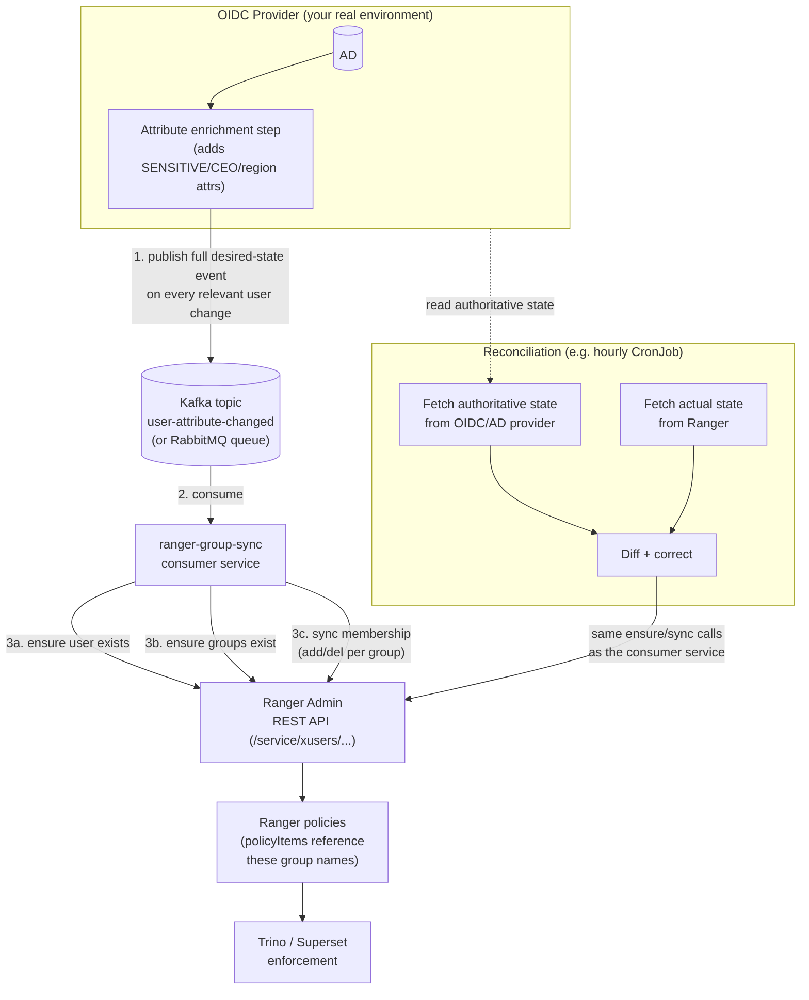

# Architecture

## The problem

Ranger authorizes access based on **users and groups**. In this
environment, the real end users authenticate through a custom OIDC
provider sitting in front of AD, and that provider adds extra attributes
during an "attribute enrichment" step (e.g. a `SENSITIVE` data-clearance
tag, a `CEO` role tag, region tags) that don't exist as real AD groups —
they're computed/derived at the OIDC layer, then handed to Superset as
claims on the user's session.

Ranger has no visibility into any of this. Its native UserSync component
only knows how to read real directory data (AD/LDAP users, groups, and
`memberOf`); it can't see attributes that only exist after the OIDC
provider's enrichment step. So if a policy needs to say "anyone with the
`SENSITIVE` attribute can query this column", Ranger has to be told about
that group membership through some *other* path — this system is that
path.

## Why event-driven + reconciliation, not periodic polling

This was decided by weighing three approaches (see the design discussion
that produced this doc):

1. **Point Ranger's UserSync at AD directly.** Doesn't work here — the
   `SENSITIVE`/`CEO`/etc. attributes aren't real AD groups, they're
   synthesized downstream by the OIDC provider. UserSync has nothing to
   read.
2. **Write the enriched attributes back into AD** (as real groups or
   extension attributes), then use ordinary UserSync. This would work and
   is the *simplest* option if your OIDC provider is allowed to write back
   to AD — it keeps AD as the single source of truth and needs zero custom
   Ranger integration. **If that's viable in your real environment, prefer
   it over everything below.** This design assumes it *isn't* viable
   (e.g. the attribute is computed per-session/dynamically, or your org
   doesn't want the OIDC layer writing to AD).
3. **Push changes to Ranger directly**, either synchronously from the
   OIDC/login path, or asynchronously through a queue. Synchronous was
   rejected: it makes user login/token-issuance depend on Ranger's
   availability, which is the wrong failure direction (an authorization
   sync system going down should never be able to block authentication).
   Asynchronous, via a durable queue with a consumer service, is what this
   doc describes.

A pure event-driven system still has a gap: **queues lose messages, code
has bugs, and events can silently dead-letter.** Nothing about "we publish
an event on every change" guarantees Ranger's state actually matches
reality at any given moment — only that it *tends toward* matching, as
long as every event is eventually processed correctly. Production systems
built this way (this is standard eventual-consistency/CDC practice, not
specific to Ranger) always pair the event stream with a periodic
reconciliation pass that re-derives ground truth and corrects drift. Both
halves are required; neither replaces the other.

## Components



| Component | Responsibility | Owns |
|---|---|---|
| OIDC provider + attribute enrichment | Computes the attributes; publishes an event whenever they change for a user. | Source of truth for *what* a user's attributes are. |
| Message broker (Kafka/RabbitMQ) | Durable, replayable transport between the OIDC layer and Ranger sync. Buffers Ranger downtime. | Delivery guarantees, ordering-per-key, retry/DLQ. |
| `ranger-group-sync` consumer service | Translates one event into the Ranger REST calls needed to make Ranger's state match it. | Real-time (seconds-scale) sync. |
| Reconciliation job | Periodically re-derives desired state directly from the OIDC/AD provider and corrects any drift in Ranger. | Eventual correctness / safety net. |
| Ranger | Stores users, groups, membership, and policies referencing them. Enforces at query time. | Authorization decisions + audit. |

## Message schema

Published by the OIDC/enrichment layer, one message per user whose
Ranger-relevant attributes changed:

```json
{
  "event_id": "018f4c2e-9b1a-7f3e-8c2d-4a1b2c3d4e5f",
  "event_time": "2026-09-24T10:15:30Z",
  "username": "alice",
  "attributes": {
    "email": "alice@example.com",
    "first_name": "Alice",
    "last_name": "Nguyen"
  },
  "ranger_groups": ["SENSITIVE", "REGION_HN"]
}
```

Field rules, and why:

- **`ranger_groups` is the full, current list of Ranger groups this user
  should belong to — never a delta.** This is the single most important
  rule in this design. A message that says "remove CEO" is only correct if
  every prior message was received, in order, exactly once. A message that
  says "groups are now `[SENSITIVE]`" is correct no matter how many times
  it's replayed, redelivered, or processed out of order relative to an
  older version of itself (see Ordering below for the one caveat). Full
  desired-state messages are naturally idempotent; deltas are not.
- **`event_id`** — a unique id per event (UUID is fine). Used for
  dedup/logging, not for correctness (correctness comes from full
  desired-state, not from dedup).
- **`event_time`** — used to detect and drop *stale* messages if
  out-of-order delivery is a concern (see Ordering).
- **`username`** — must match (or be mappable to 1:1 with) the username
  Ranger/Trino/Superset already know the user by. If your OIDC `sub` claim
  differs from the Trino/Ranger username, resolve that mapping in the
  producer, not in this consumer.
- **`attributes.first_name`** — required by Ranger's bulk user-sync
  endpoint (see RANGER-REST-API-REFERENCE.md); if your IdP doesn't reliably
  provide one, fall back to the username rather than send blank/null, or
  Ranger silently drops the user record.

## Data flow walkthrough

Concrete example matching the one used when this was designed: user
**alice** starts with attributes `SENSITIVE, CEO`; her `CEO` attribute is
later revoked, leaving just `SENSITIVE`.

1. OIDC enrichment recomputes alice's attributes, sees they changed, and
   publishes:
   ```json
   {"username": "alice", "ranger_groups": ["SENSITIVE"], ...}
   ```
   (not `["SENSITIVE"]` plus some "remove CEO" instruction — just the new
   full state.)
2. The consumer service reads this message and:
   a. Resolves alice's **current** Ranger group membership by asking
      Ranger directly (`GET /service/xusers/{userId}/groups`) — Ranger is
      the source of truth for *current* state; the message is the source
      of truth for *desired* state.
   b. Diffs: current `{SENSITIVE, CEO}` vs desired `{SENSITIVE}` → needs to
      **remove** alice from `CEO`, no group to add her to that she isn't
      already in.
   c. Ensures the `SENSITIVE` group still exists (idempotent no-op if it
      already does).
   d. Calls Ranger's bulk membership endpoint with
      `{"groupName": "CEO", "delUsers": ["alice"]}` (no entry needed for
      `SENSITIVE` since nothing changed there).
3. Ranger updates `x_group_users`; any policy with `policyItems.groups`
   containing `CEO` no longer applies to alice, immediately (Ranger's
   plugins poll for policy/userstore updates on their own interval,
   typically ~30s — see the `audit-logging` design in this repo for the
   equivalent behavior confirmed against this org's Trino/Ranger plugin).
4. Separately, on its own schedule, the reconciliation job pulls alice's
   attributes straight from the OIDC/AD provider, sees Ranger already
   matches, and does nothing. If step 2-3 above had failed silently for
   any reason, this pass is what catches and fixes it.

## Ordering

Kafka topics guarantee ordering **within a partition**. Partition the
topic by `username` (i.e. use `username` as the Kafka message key) so that
all events for one user are strictly ordered relative to each other, even
though events for *different* users may be processed out of order relative
to each other — which is fine, since users are independent.

Even with per-key ordering, a consumer restart/rebalance or a redelivered
message can occasionally hand you a message older than one you already
processed. Two independent mitigations, both cheap:

- Compare the incoming message's `event_time` against the last-processed
  `event_time` for that user (store it — see Implementation Guide) and
  drop the message if it's older.
- Because messages carry full desired-state, even processing one
  out-of-order in the rare case just means the *next* message (which is
  newer and also carries full state) will immediately correct it. The
  window of incorrectness is bounded by "until the next real event or the
  next reconciliation pass" — never permanent, unlike it would be with
  delta events.

If using RabbitMQ instead of Kafka: use a single queue (or consistent-hash
exchange keyed by username) rather than a naive fanout, for the same
per-user-ordering reason. RabbitMQ doesn't give you Kafka's log-replay
capability, which matters for reconciliation-by-replaying-history — this
design doesn't rely on replay (reconciliation re-derives from the IdP
instead), so RabbitMQ is a legitimate choice if that's what your org
standardizes on. Kafka is used as the concrete example throughout the rest
of these docs; swap it for the RabbitMQ equivalent per the Implementation
Guide's notes if that's your broker.

## Failure modes

| Failure | What happens | Mitigation |
|---|---|---|
| Ranger is down when a message arrives | The consumer's call to Ranger fails. | Consumer does **not** commit the Kafka offset on failure — the message is redelivered (to this or another consumer instance) once Ranger recovers. See retry/backoff in Implementation Guide. |
| Message is malformed / references a nonsensical state | Bulk membership call would silently no-op per-field (see REST reference), which could look like silent success. | Validate the message schema *before* calling Ranger; reject and route to a dead-letter topic with the validation error attached, rather than sending a partial/garbage request. |
| Consumer crashes mid-processing (after ensuring user/groups, before membership sync, or vice versa) | Partial state: e.g. group exists in Ranger but membership wasn't updated yet. | Safe by design — the whole flow is idempotent per message. On restart/redelivery, the consumer just re-runs all three calls; ensure-user and ensure-group are no-ops if already done, and the membership diff is recomputed fresh against Ranger's actual current state. |
| A message is lost entirely (never published, or dropped somewhere before the topic) | Ranger silently keeps stale group membership for that user indefinitely. | This is exactly what the **reconciliation job** exists to catch — it doesn't depend on the event stream at all, it re-derives from the IdP independently. |
| Duplicate messages (broker at-least-once delivery, retries) | Processed twice; harmless, because full-desired-state + diff-against-current-Ranger-state means the second run is a no-op. | No special handling needed — this is why full desired-state matters. |
| Ranger user/group referenced by a message doesn't exist yet in Ranger | The bulk membership endpoint (`ugsync/groupusers`) **silently ignores** unknown usernames/groups — no error, just nothing happens. | The consumer must call ensure-user and ensure-group **before** the membership call, every time, in that order (see REST reference's #1 gotcha). Never skip this "just to save a call" — it's the most likely way this whole system quietly stops working. |
| Poison message (repeatedly fails processing, e.g. a permanent bug) | Without a limit, the consumer retries forever, blocking that partition (all later messages for that user queue up behind it). | Cap retries (e.g. 5, with exponential backoff), then route to a dead-letter topic and alert — don't retry forever. |

## Security considerations

- The consumer service needs a Ranger account with **`ROLE_SYS_ADMIN`** —
  every endpoint used here (`/xusers/ugsync/*`) requires it, and Ranger
  doesn't offer a narrower built-in role scoped to just user/group
  management. Use a **dedicated service account**, not the human
  `admin` account, so it can be rotated/audited/revoked independently.
- Store Ranger credentials and broker credentials in a Kubernetes
  `Secret` (or your org's secret manager), injected as env vars — never
  hardcoded in the service's source or image. See `k8s/secret-example.yaml`.
- The reconciliation job needs read access to your OIDC/AD provider's user
  attribute data — scope that credential to read-only if your provider
  supports it.
- All the endpoints in this design **create/modify users and groups**, not
  policies — no code here grants access by itself. A human still has to
  write the actual Ranger policy that says "group `SENSITIVE` can read
  column X" (see Implementation Guide, step 7). Keep that separation: this
  system manages *membership*, policies stay a deliberate, reviewed,
  human action.

## Observability

At minimum, the consumer service and reconciliation job should emit:

- A counter of messages processed successfully vs. failed vs.
  dead-lettered.
- A counter of "drift corrections made" from the reconciliation job — if
  this is ever consistently non-zero, something upstream (the event path)
  is unreliable and needs investigating, not just silently patched over by
  reconciliation forever.
- Consumer lag (standard Kafka consumer group lag metric) — a growing lag
  means Ranger is slow/down or the consumer can't keep up.
- Structured logs including `event_id` and `username` on every processing
  attempt, so a specific user's sync history can be traced end-to-end.

Alert on: dead-letter topic depth > 0, consumer lag growing unbounded, and
reconciliation job failures (it's the safety net — if *it's* also broken,
you have no backstop left).
